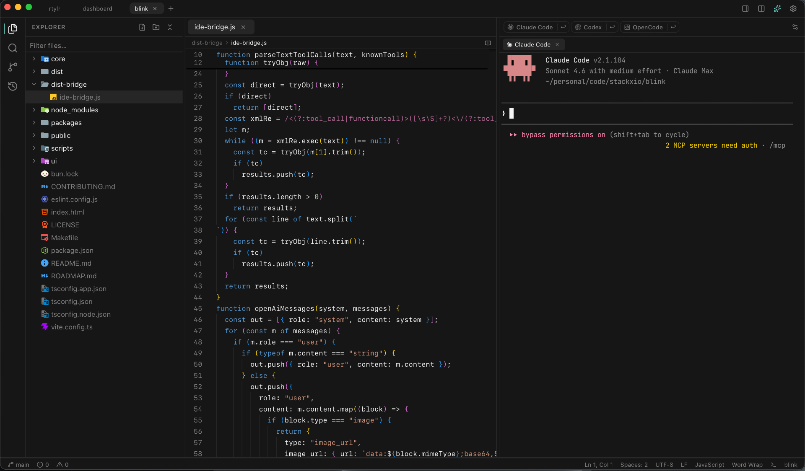

# Codrift

**Why Codrift?** Modern dev workflows are split across too many tools — an editor here, a terminal there, an AI agent in another window, and a chat tab somewhere else. Codrift collapses all of it into a single workspace: Monaco editor, integrated terminal, multi-agent runner (Claude Code, Codex, Gemini…), and a native AI chat panel with OpenAI-compatible providers — all in one window, all sharing the same workspace context.



---

## Features

### Editor

- **Monaco editor** — the same engine that powers VS Code, with syntax highlighting for 20+ languages
- **LSP integration** — autocomplete, diagnostics, hover, go-to-definition, find usages, rename, and code actions over JSON-RPC stdio; servers are started on demand per file extension
- **Inline completions** — AI-powered inline suggestions via the configured provider
- **Format on save** — triggers the LSP formatter when enabled
- **EditorConfig support** — per-file indent style and tab size read from `.editorconfig`
- **Bracket pairs, rulers, minimap, sticky scroll, inlay hints** — all individually toggled in settings
- **Mouse-wheel font zoom** — configurable
- **Word wrap toggle** — available from the status bar
- **Find and replace** — built-in panel with case-sensitive, whole-word, and regex modes
- **Cursor position history** — navigate back and forward through past positions with Alt+Left / Alt+Right
- **Merge conflict resolution** — inline conflict region detection and accept/reject bar
- **Inline AI edit** — select code, invoke a natural-language instruction to rewrite it in place
- **Markdown preview** — rendered side-by-side preview for `.md` files
- **Symbol search** — document-level and workspace-level symbol navigation
- **Peek panel** — inline reference and definition peek without leaving the current file
- **Git gutter** — inline +/~/- annotations showing unstaged changes
- **Auto-save** — debounced save on every change; toggled per workspace
- **Tab pinning** — pin important files to keep them from being closed
- **Split editor pane** — open a second editor pane side-by-side
- **Reopen closed tab** — recover recently closed tabs

### File Explorer

- Lazy-loading tree with expand/collapse state persisted per workspace
- Virtual scrolling for large directory trees
- File and directory creation, rename, and delete from context menu
- Bookmarks for quick access to frequently used files and folders
- Material file-type icons

### Integrated Terminal

- xterm.js with a native PTY spawned by the Rust backend via `portable-pty`
- Multiple terminal sessions per workspace; each tab is independently named
- Split terminal — run two sessions side-by-side
- Shell profile picker: Default ($SHELL), zsh, bash, sh, fish
- Port detection — terminal output is scanned for `localhost:PORT` patterns; detected ports are shown as clickable links
- In-terminal search (Ctrl+F) powered by the xterm.js search addon
- Theme synchronization — terminal colors update immediately when the app theme changes
- Sessions are scoped per workspace but PTY processes stay alive when switching workspaces

### AI Agent Panel

The AI panel has two modes:

**Built-in chat** — a conversational interface backed by the configured AI provider (Ollama or a custom OpenAI-compatible API). Supports:

- Threaded conversations persisted per workspace
- 16 built-in tools: file read/write/edit, directory tree, git status/diff/log/commit, run commands, search, glob, and more
- Slash commands: `/commit`, `/pr`, `/review`, `/fix`, `/test`, `/explain`, `/refactor`, `/diff`, `/compact`, and more
- `/compact` — partial compress that summarizes old context while keeping recent messages verbatim
- Skill injection via system prompt (from Settings > Skills)
- File and folder attachment context, image attachments, @mention files
- Memory: user preferences (`~/.codrift/user.md`) and project memory (`AGENTS.md`) injected into every session
- Chat modes: Agent, Plan, Debug, Ask

**CLI agent runner** — launches supported AI coding agents in a dedicated terminal. Supported agents:

| Agent              | Binary               | Session resume |
| ------------------ | -------------------- | -------------- |
| Claude Code        | `claude`             | `--resume`     |
| Codex              | `codex`              | `codex resume` |
| Gemini             | `gemini`             | `--resume`     |
| OpenCode           | `opencode`           | `--continue`   |
| Pi                 | `pi`                 | —              |
| GitHub Copilot CLI | `gh copilot suggest` | —              |
| Cursor Agent       | `cursor --agent`     | —              |

Session IDs are captured from terminal output and persisted per workspace so previous sessions can be resumed across app restarts. Each agent can be enabled/disabled and given a custom binary path.

### Git

- Status panel showing staged and unstaged changes with file status icons
- Stage, unstage, and discard individual files or hunks
- Commit with message editor
- Hunk viewer — inline diff of each changed hunk
- Stash manager — create, apply, and delete stashes
- Git log viewer — commit history with diff
- Branch switcher and new-branch creation from the status bar

### Search

- Workspace-wide full-text search with real-time results
- Case-sensitive, whole-word, and regex modes
- Include/exclude glob filters
- Find-and-replace across all matching files

### Local History

- Automatic snapshot of every saved file revision stored locally
- Browse per-file history with timestamps
- Preview and restore any previous version

### Workspace Management

- Multiple workspaces open simultaneously as tabs in the titlebar
- Each workspace maintains independent: open files, active file, split pane, side panel, bottom panel, terminal sessions, expanded directories, and layout mode
- Workspace state (open tabs, cursor positions, scroll positions) is persisted and restored on next launch
- Recent workspaces list with fuzzy search
- CLI integration — pass a file path or directory path as a command-line argument to open it at launch

### Settings

- **General** — auto-save, confirm on quit, tab size, font size, minimap, word wrap, indent guides, sticky scroll, inlay hints, code actions, inline completions, format on save, keybinding customization
- **AI Providers** — configure Ollama (endpoint + model) or a custom OpenAI-compatible API (endpoint, model, API key)
- **Skills** — create, edit, and delete Markdown skill files injected as system prompts
- **Memory** — edit user memory (`~/.codrift/user.md`) and project memory (`AGENTS.md`) directly in settings
- **Appearance** — dark / light / system theme, editor font family, VS Code theme import
- **About / Licenses**

### Appearance

- Dark, light, and system (auto) themes
- Custom theme support using a JSON schema mapped to CSS custom properties
- VS Code theme import — upload any VS Code `.json` theme file and it is translated to the Codrift theme format
- Custom editor font family

### Other

- **Quit confirmation** — optional dialog when there are unsaved files
- **Auto-updater** — background update check with in-titlebar download progress and restart prompt
- **Single-instance enforcement** — a second launch focuses the existing window
- **macOS native** — custom titlebar with traffic-light integration and drag region

---

## Tech Stack

| Layer            | Technology                         |
| ---------------- | ---------------------------------- |
| Desktop shell    | Tauri v2 (Rust)                    |
| Frontend         | React 19 + TypeScript + Vite       |
| Styling          | SCSS + CSS custom properties       |
| Code editor      | Monaco Editor                      |
| Terminal         | xterm.js + `portable-pty` (Rust)   |
| LSP broker       | Rust (JSON-RPC over stdio)         |
| State management | Zustand                            |
| Database         | SQLite via `rusqlite`              |
| Package manager  | Bun                                |
| Icons            | Lucide React + Material Icon Theme |

---

## Project Structure

```
codrift/
├── ui/                        # React frontend
│   ├── ai/                    # AI panel (BlinkCodePanel, CliAgentPanel, agent definitions)
│   ├── components/            # Shared UI primitives
│   ├── features/settings/     # Settings pages (General, Providers, Skills, Memory, Appearance, …)
│   ├── hooks/                 # Shared hooks
│   ├── ide/
│   │   ├── editor/            # Monaco editor wrapper, LSP client, git gutter, merge conflicts
│   │   ├── explorer/          # File tree with virtual scrolling
│   │   ├── git/               # Git panel, hunk viewer, stash manager, log viewer
│   │   ├── history/           # Local file history panel
│   │   ├── layout/            # Activity bar, tab bar, titlebar, status bar, command palette
│   │   ├── search/            # Workspace search and replace panel
│   │   └── terminal/          # xterm.js terminal panel
│   ├── lib/                   # Theme, keybindings, VS Code theme import
│   ├── overlays/              # Settings overlay
│   ├── store.ts               # Zustand app and workspace state
│   ├── App.tsx
│   └── main.tsx
├── core/                      # Tauri / Rust backend
│   ├── src/
│   │   ├── commands/          # Tauri IPC commands (editor, terminal, git, LSP, AI bridge, …)
│   │   ├── db/                # SQLite schema, queries, models
│   │   ├── lsp/               # LSP manager, transport, server registry
│   │   ├── services/          # Workspace persistence service
│   │   ├── settings/          # App config, prompts, skills
│   │   └── main.rs
│   ├── Cargo.toml
│   └── tauri.conf.json
├── packages/
│   └── blink-code/            # AI bridge: engine, providers, tools, slash commands, compact
│       ├── ide-bridge.ts      # Entry point and message loop
│       ├── tools/             # One file per AI tool (16 tools)
│       └── panel/             # Engine, providers, memory, system prompt, slash commands
├── scripts/
├── package.json
└── vite.config.ts
```

---

## LSP Support

Servers are started automatically when a file with a recognized extension is opened. The following language servers are supported out of the box (installed separately):

| Language                | Server                        | Install                                                |
| ----------------------- | ----------------------------- | ------------------------------------------------------ |
| TypeScript / JavaScript | `typescript-language-server`  | `npm install -g typescript-language-server typescript` |
| Rust                    | `rust-analyzer`               | `brew install rust-analyzer`                           |
| Python                  | `pyright-langserver`          | `npm install -g pyright`                               |
| Go                      | `gopls`                       | `go install golang.org/x/tools/gopls@latest`           |
| CSS / SCSS / Less       | `vscode-css-language-server`  | `npm install -g vscode-langservers-extracted`          |
| HTML                    | `vscode-html-language-server` | `npm install -g vscode-langservers-extracted`          |
| JSON                    | `vscode-json-language-server` | `npm install -g vscode-langservers-extracted`          |
| Svelte                  | `svelteserver`                | `npm install -g svelte-language-server`                |
| Vue                     | `vue-language-server`         | `npm install -g @vue/language-server`                  |
| Tailwind CSS            | `tailwindcss-language-server` | `npm install -g @tailwindcss/language-server`          |
| YAML                    | `yaml-language-server`        | `npm install -g yaml-language-server`                  |
| TOML                    | `taplo`                       | `cargo install taplo-cli --locked`                     |

Custom server binaries can be placed in `~/.codrift/servers/` and will take precedence over PATH.

---

## Getting Started

### Prerequisites

- [Rust](https://www.rust-lang.org/tools/install) (stable)
- [Bun](https://bun.sh/) 1.3+

### Development

```bash
bun install
bun run app
```

### Production build

```bash
bun run app:build
```

---

## Scripts

| Command             | Description                                                      |
| ------------------- | ---------------------------------------------------------------- |
| `bun run app`       | Development mode (Vite + Tauri)                                  |
| `bun run app:build` | Production build                                                 |
| `bun run typecheck` | TypeScript type check                                            |
| `bun run lint`      | ESLint                                                           |
| `bun run format`    | Prettier + `cargo fmt`                                           |
| `bun run db:reset`  | Delete `~/.codrift/codrift.db` so it is recreated on next launch |

---

## Data Locations

| Path                    | Contents                                                           |
| ----------------------- | ------------------------------------------------------------------ |
| `~/.codrift/codrift.db` | SQLite database: workspaces, open files, cursor positions, threads |
| `~/.codrift/user.md`    | Global user memory injected into every AI session                  |
| `~/.codrift/servers/`   | Locally installed LSP server binaries (checked before PATH)        |
| `~/.codrift/skills/`    | Skill Markdown files editable in Settings > Skills                 |
| `~/.codrift/sessions/`  | AI chat thread history per workspace                               |

---

## Platform Support

Codrift currently targets **macOS** as its primary platform. Windows and Linux support is planned for a future release.

---

## Contributing

See [CONTRIBUTING.md](CONTRIBUTING.md).

## License

[MIT](LICENSE)
